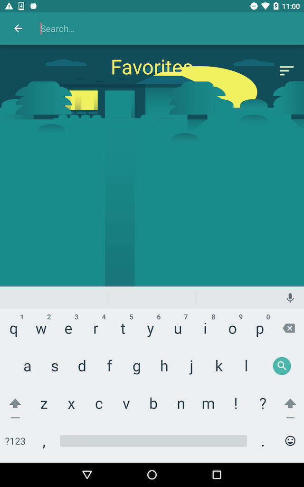
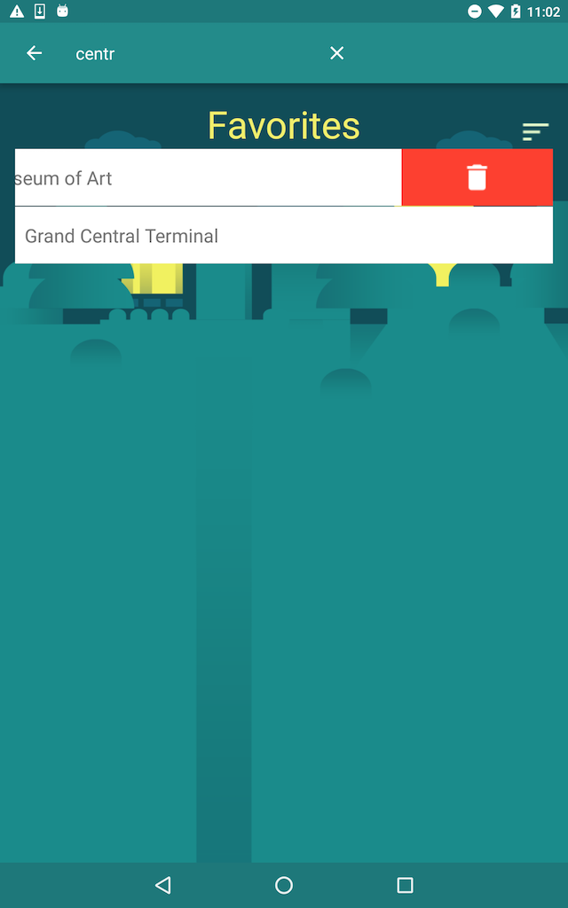
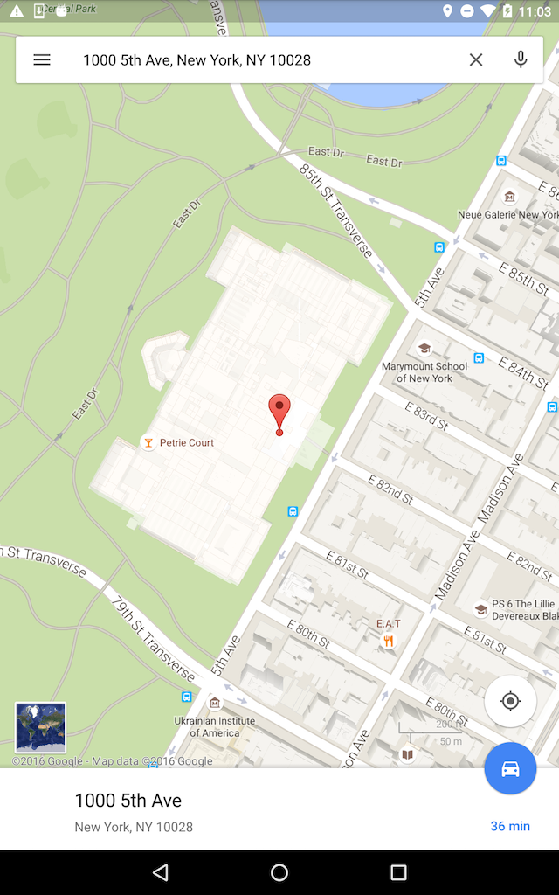

# NeighbourHood-Guides
This is an app for you to be able to search for locations.

####
Home Page

- This is the first screen that appears when your app starts. On this screen you can see all the locations that you have favorited.
When you first use this app, there will be no favorites, but the more you use the app and favorite locations, the more that home screen populates.

- On the upper right hand side of the app, you see a swipe image. This is to indicate that if you swipe a certain item on your list, you can delete it. 

- Swipe to the right, press the trash button, and immediately that location is removed from your favorite's list. 

- If you press the search button on the toolbar, the keyboard will appear and you can type if the location that you want to search.
###
###
Location Info Page

- This is the page that gives you the description of the location. You can also see an image, and the address. If you press on the address,
it will take you out of the current app and take you to the Google Maps app, and you can press the Route button and get directions to the locations.

- The Heart Favorite button on the right side is there so that you can press it and add it as a 'Favorite' on your list. 
 
- You will see 5 stars on the left side, and that is there so you can add a rating for the location. You can either press or swipe on the stars to set a rating.

- If you press the back button, it takes you back to the Home Page where you can see the list of Favorite's again.
  If you had favorited a location, it will appear on your list. 
###

---------------------

Example of the App.

